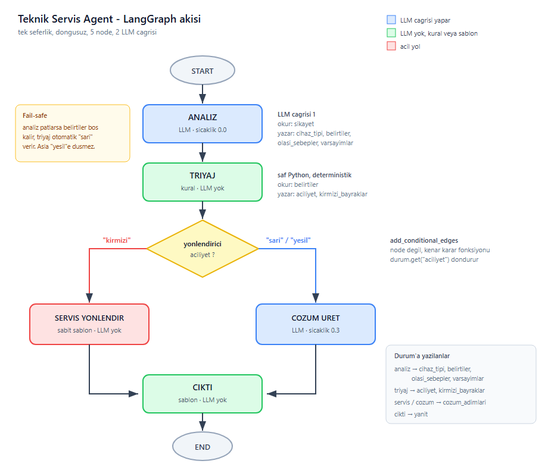

# Teknik Servis Agent

<p align="center">
  
</p>

LangGraph ile kurulmus bir teknik servis danisma ajanidir. Kullanici bilgisayariyla
ilgili sikayetini serbest metin olarak yazar; sistem sikayeti analiz eder,
aciliyetini belirler ve iki yoldan birine gider:

- **Acil degilse** kullanicinin kendi yapabilecegi adimlari uretir.
- **Acilse** cihaza mudahale etmemesi ve yetkili servise basvurmasi uyarisini basar.

## Tasarim ilkesi: LLM cikarim yapar, kod karar verir

Projenin tasiyici fikri budur. Dil modeli sikayetten sadece **belirtileri cikarir**.
"Bu durum acil mi" sorusunu model degil, `kurallar.py` icindeki saf Python fonksiyonu
cevaplar.

Sebep: yanik kokusu, sismis batarya, siviya temas gibi vakalarda modelin
"once sunu deneyin" demesi kullaniciya zarar verebilir. Guvenlikle ilgili karar
deterministik olmali. Kirmizi bayrak tespit edilirse yonlendirici modelin gorusune
bakmadan acil yola gider ve o yolda **hic LLM cagrisi yapilmaz**, cikti sabit
sablondan gelir.

Bunun calismasi icin model belirtileri serbest metin olarak degil, `BELIRTI_KODLARI`
icindeki sabit listeden secer. Aksi halde model bir seferinde "batarya sismis",
bir seferinde "pil kabarmis" yazar ve kural motoru hicbirini yakalayamaz.

## Akis

| Node | Gorevi | LLM |
|---|---|---|
| `analiz` | Sikayeti yapilandirilmis veriye cevirir | var (sicaklik 0.0) |
| `triyaj` | Kirmizi bayrak kontrolu, aciliyet atar | yok |
| `servis_yonlendir` | Acil yol, sabit uyari sablonu | yok |
| `cozum_uret` | Kullanicinin yapabilecegi adimlar | var (sicaklik 0.3) |
| `cikti` | State'i okunabilir metne cevirir | yok |

Istek basina en fazla 2 model cagrisi yapilir. Acil vakalarda 1.

Aciliyet seviyeleri:

- `kirmizi` yangin, patlama veya elektrik carpmasi riski. Kullanici cihaza dokunmamali.
- `sari` donanim arizasi suphesi. Adimlar denenebilir ama uyarili.
- `yesil` buyuk ihtimalle basit bir ayar sorunu.

### Fail-safe

Belirsizlik her zaman ihtiyatli tarafa duser. Model cagrisi patlarsa (kota, ag hatasi,
bozuk cevap) `belirtiler` bos kalir, `triyaj_yap` bos liste gorunce otomatik olarak
`sari` doner. Sistem asla sessizce `yesil`e dusmez, cunku en kotu hata modu
"sorun yok" mesaji basmaktir.

## Kurulum

```bash
git clone <repo-adresi>
cd teknik-servis-agent

python -m venv .venv
.venv\Scripts\activate
pip install -r requirements.txt
```

Proje kokune `.env` dosyasi olusturun:

```
GOOGLE_API_KEY=kendi_anahtariniz
```

Anahtar [Google AI Studio](https://aistudio.google.com/apikey) uzerinden ucretsiz
alinir. Varsayilan model `gemini-2.5-flash`, ucretsiz katmanda calisir.
Model adi ve sicaklik sadece `model.py` icinde tanimlidir; baska bir saglayiciya
gecmek isterseniz degistirilecek tek dosya orasidir.

## Kullanim

```bash
python main.py
```

```
Sikayetiniz: laptopumda ses gelmiyor
```

Cikmak icin `cik` yazin.

### API cagrisi yapmadan test

`test_akis.py` grafigin dogru dallandigini sahte analiz verisiyle dogrular.
Kirmizi yol testi hic model cagrisi yapmaz:

```bash
python test_akis.py
```

Triyaj mantigini tek basina test etmek icin:

```bash
python kurallar.py
```

## Dosya yapisi

```
durum.py        grafigin state semasi (TypedDict)
semalar.py      LLM'den istenen yapilar (Pydantic)
kurallar.py     belirti kodlari(donma, kasma), acil durumlar icin keyler(kirmizi bayrak), acil durum akışı triyaj mantıgı
model.py        model baglantisi, tek noktadan
promptlar.py    prompt metinleri ve acil yol sablonu
dugumler.py     bes node fonksiyonu
grafik.py       StateGraph kurulumu ve kenarlar
test_akis.py    API'siz akis testi
main.py         calistirma
workflow.svg    akis semasi (kaynak)
workflow.mmd    akis semasi (mermaid, duzenlenebilir)
```

## Sinirlar

- Tek seferlik calisir, kullaniciya geri soru sormaz. Eksik bilgi oldugunda analiz
  node'u `varsayimlar` alanini doldurur ve cikti kosullu kurulur.
- Sadece bilgisayar (masaustu ve dizustu) kapsamindadir.
- Tibbi veya hukuki bir tavsiye degildir; gercek bir teknik servisin yerini tutmaz.
